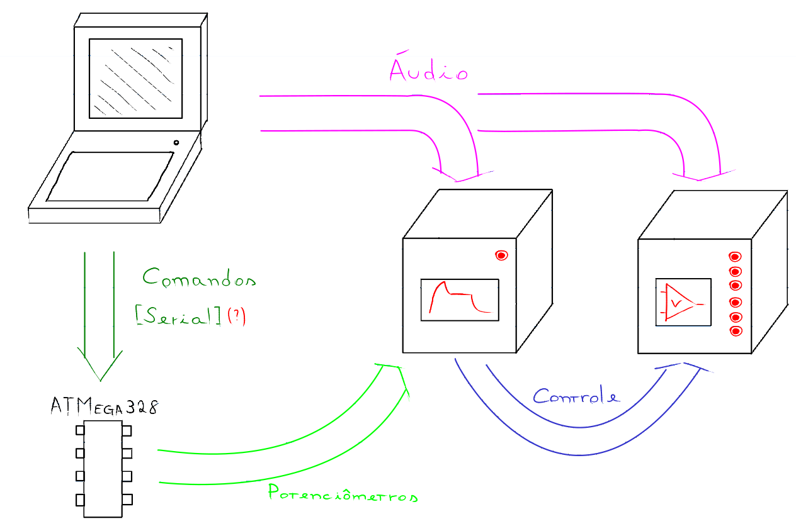

     
# Projeto Potentia
O Projeto Potentia é um sintetizador modular desenvolvido pelos alunos Henrique Amaral Onuki e Gabriel Garcia como proposta interdisciplinar para as unidades curriculares de Projeto Integrador II, Microcontroladores I, Programação Orientada a Objetos e Instrumentação Eletrônica.

O sistema combina circuitos analógicos, microcontroladores e um aplicativo de computador, com o objetivo de tornar mais acessível e didática a compreensão de síntese sonora modular.

## Visão Geral
O Potentia é composto por dois módulos principais:

- AHDSR (Attack, Hold, Decay, Sustain, Release): Gera sinais de controle com forma envolvente para modular outros módulos.

- VCA (Voltage-Controlled Amplifier): Amplifica sinais de áudio conforme a tensão de controle recebida.

Ambos os módulos são fisicamente independentes, com suas próprias PCBs e microcontroladores ATmega328P (Arduino Nano). Eles podem funcionar separadamente, como módulos padrão, ou em conjunto com integração total por meio de uma conexão de 8 fios jumper.

A interface de controle é feita por um aplicativo de computador que se comunica com o AHDSR via USB, permitindo a configuração dos parâmetros da envoltória, controle de modos de trigger e sequenciamento. Quando os módulos estão integrados, o aplicativo também pode controlar a forma de onda e frequência da fonte sonora do VCA.

## Objetivos
O projeto busca:
- Tornar a síntese sonora mais didática, visual e acessível;

- Demonstrar na prática como sinais de controle (como envelopes AHDSR) interagem com sinais de áudio em sistemas analógicos;

- Integrar técnicas de eletrônica analógica, microcontroladores e programação orientada a objetos;

- Criar um sistema modular funcional e extensível.

## Funcionalidades
- Controle digital dos parâmetros do AHDSR por aplicativo (via potenciômetros digitais DS1803);

- Seleção de modo de trigger (interno por BPM, externo por entrada P2, ou manual via app);

- Sequenciador de presets;

- Visualização da forma de onda AHDSR;

- Geração de áudio no VCA com seleção entre:

- Áudio externo (entrada P2),

- Onda senoidal/quadrada/triangular (via AD9833),

- Ruído branco (gerado internamente);

- Controle remoto da forma de onda e frequência do VCA via AHDSR;

- Display LCD no VCA que mostra a forma AHDSR aplicada;

- Alimentação via USB, com possibilidade de alimentar ambos os módulos por um único cabo.

# ResiFlow - Interface de Controle
O ResiFlow é o aplicativo responsável pelo controle digital do sistema. Desenvolvido em C++ com Qt, ele permite:
- Ajustar os parâmetros do AHDSR (A, H, D, S, R);

- Alternar modos de trigger;

- Controlar BPM do trigger interno;

- Visualizar a forma de onda AHDSR;

- Gerenciar presets e sequenciadores;

- Enviar comandos indiretos ao VCA quando conectado.
[**Mais sobre o ResiFlow**](./ResiFlow/README.md) 

## Estrutura Física

- Os dois módulos são montados em cases de acrílico, com fácil visualização dos circuitos;

- Conectores P2 estéreo são usados para entradas e saídas de áudio e controle;

- A conexão entre os módulos é feita por 8 fios jumper (limitação conhecida do projeto);

- Cada módulo possui sua própria fonte de alimentação via USB, mas também é possível alimentar o VCA diretamente pela conexão com o AHDSR.

## Status do Projeto

O projeto foi concluído como uma prova de conceito funcional. Futuras melhorias incluem:

- Substituição da conexão jumper por um conector mais robusto;

- Expansão da funcionalidade do display no VCA;

- Suporte a outros formatos de entrada/saída compatíveis com o padrão Eurorack.
