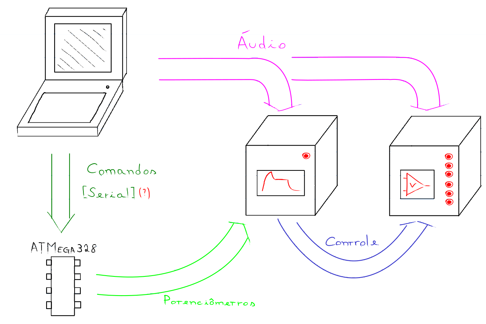

## Interface de Controle de Envelope ADSR para VCA
Projeto para unidade curricular de Projeto Integrador 2.

Este projeto consiste em um sistema de controle que realiza comunicação entre um computador e um microcontrolador ATmega328P. 
O computador envia comandos que definem os parâmetros de um envelope ADSR (Attack, Decay, Sustain, Release). 
Esses parâmetros são processados pelo microcontrolador, que gera um sinal de controle correspondente e o envia para um módulo ADSR. 
O sinal do envelope gerado é então aplicado a um VCA (Amplificador Controlado por Voltagem), responsável por modular a amplitude 
do sinal de áudio provindo de um sinal original, conforme o envelope definido. O sistema permite, assim, controlar a dinâmica sonora 
de forma precisa e programável, podendo ser utilizado em aplicações de síntese sonora, processamento de áudio e instrumentos eletrônicos.

