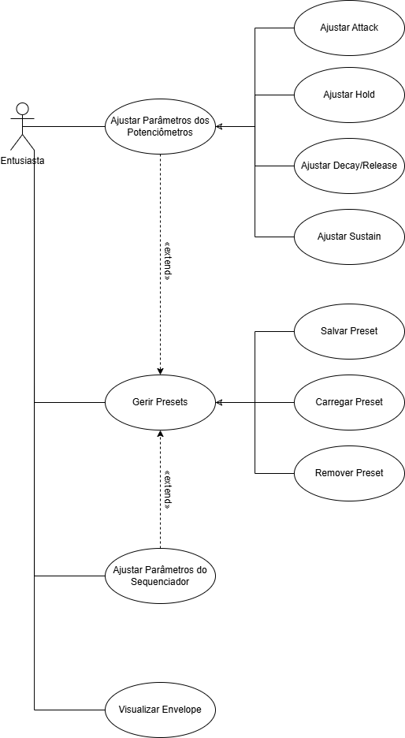
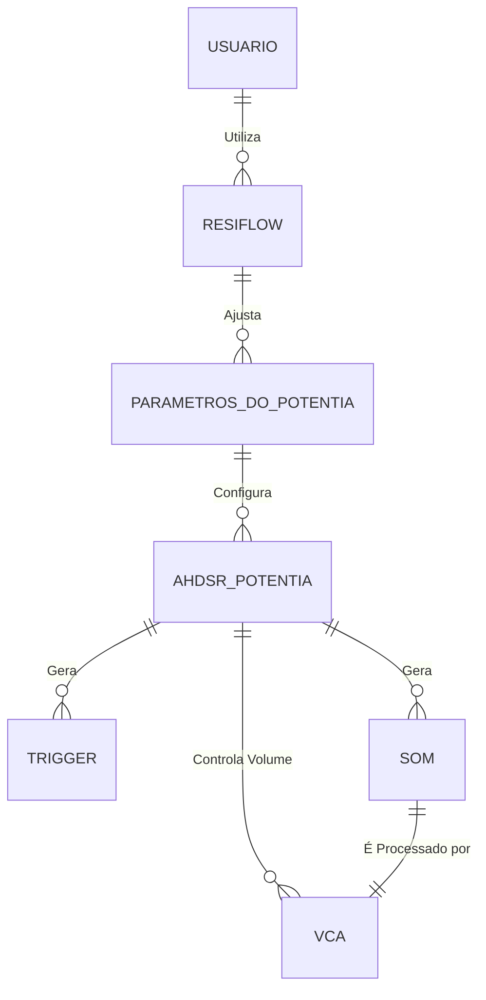

# Análise orientada a objeto

## Descrição Geral do domínio do problema

Uma forma fácil e intuitiva de realizar o controle dos parâmatros de controle de um envelope AHDSR.

Faz a interface digital com quatro potenciômetros para ajustar seus parâmetros, e formas de guardar, carregar e remover tais parâmatros em presets.

Exibe um gráfico em tempo real do comportamento esperado do envelope.

Apresenta um sequenciador para ativar o envelope em ordem e tempo definido.

Pode ser utilizado por entusiastas da área musical e eletrônica para explorar um melhor e mais controlado ajuste de parâmetros de um envelope AHDSR.

## Diagrama de Casos de Uso

 
## Diagrama de Domínio do problema

## Diagrama de Domínio do Problema

## Diagrama de Domínio do Problema

O domínio do problema do ResiFlow envolve a interação entre o usuário e o módulo "AHDSR Potentia". O usuário, através do ResiFlow, pode ajustar todos os parâmetros do envelope (Attack, Hold, Decay, Sustain, Release), bem como controlar dinamicamente a frequência do trigger interno e a frequência do som gerado pelo AHDSR Potentia. O som gerado é fornecido ao VCA, que tem seu volume controlado pelo envelope do próprio AHDSR Potentia.

### Principais entidades:
- **Usuário:** Pessoa que controla o sistema pelo app.
- **ResiFlow:** Aplicativo de controle e interface entre usuário e AHDSR Potentia.
- **AHDSR Potentia:** Módulo físico que:
    - Gera envelope (parâmetros: Attack, Hold, Decay, Sustain, Release)
    - Gera trigger interno (com frequência controlada)
    - Gera o sinal de som (com frequência controlada)
    - Controla o volume do VCA via envelope
- **Parâmetro do AHDSR Potentia:** Attack, Hold, Decay, Sustain, Release, frequência do trigger, frequência do som.
- **VCA:** Amplificador controlado por tensão, recebe o som e tem o volume modulado pelo envelope do AHDSR Potentia.
- **Som:** Sinal gerado pelo AHDSR Potentia, enviado ao VCA.

### Relações:
- O **Usuário** utiliza o **ResiFlow** para ajustar os **Parâmetros do AHDSR Potentia**.
- O **ResiFlow** envia comandos para o **AHDSR Potentia** configurar envelope, trigger e som.
- O **AHDSR Potentia**:
    - Gera trigger interno
    - Gera som cuja frequência é ajustada pelo usuário
    - Modula o volume do **VCA** pelo envelope
- O **VCA** recebe o **Som** do AHDSR Potentia e ajusta seu volume conforme o envelope.

### Diagrama (mermaid):

[Retroceder](README.md) | [Avançar](projeto.md)

